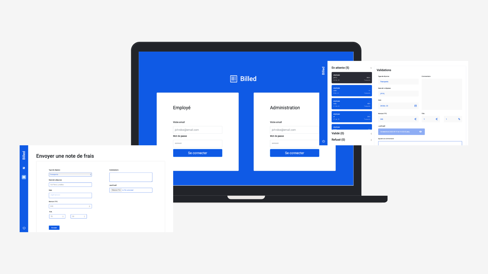

# Billed App Project

## Description
This is the 9th project of the OpenClassrooms Front-End Developer path. The goal was to debugging and testing an HR SaaS with Jest.



## Table of Contents

* [Installation](#installation)
* [Technologies](#technologies)

## Installation
You have to install the following dependencies:
* [Node.js](https://nodejs.org/en/)

To install the dependencies, run the following command:
```
npm install
```

You have to git clone the project and read the README.md file in each folder.
```bash
git clone
```

First install the Billed-app-FR-Back with information in the README.md file.
Then install the Billed-app-FR-Front with information in the README.md file.

## Technologies
* [Node.js](https://nodejs.org/en/)
* [React](https://fr.reactjs.org/)
* [Jest](https://jestjs.io/)
